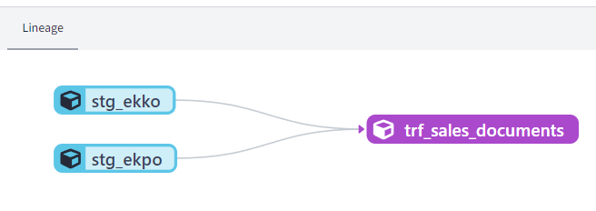
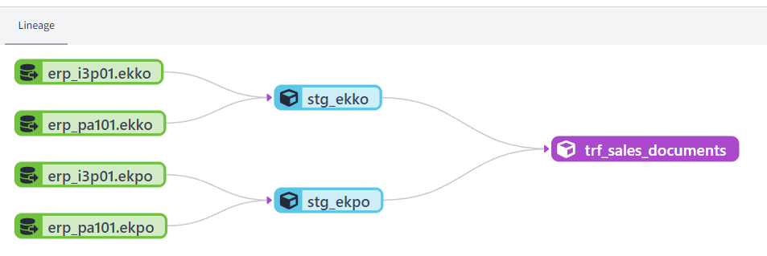

# Documentation for the `stg_erpall` macro

This macro is available on the `sie_dbt_utils` package, since revision `"sie_dbt_utils_230210"`. And it's main goal is to create the staging models reading directly from the `PRD_DISTRIBUTE.ERP_RAW_<system>` schema.

## Performance considerations
The [Domain ERP (DOM_ERP)](https://wiki.siemens.com/pages/viewpage.action?pageId=470434608) staging project had the goal to provide a unique staging layer for all the ERP tables, but the experience has shown us that this extra layer os views causes some performance issues on the consumer projects. Either the compilation time increases drastically, or the execution time is also not the best. This is now even more evident with the new RBAC concept that exists on the Distribution Layer.

This `stg_erpall` macro makes it possible that each project create their own `erpall` views to stage tables from several ERP Systems, without having any of the performence issues from DOM_ERP.  
## Example
```sql 
{{ sie_dbt_utils.stg_erpall('ekko',
			erp_systems=  [],
			include_columns=['mandt', 'ebeln'],
			create_keys=False
) }}
```
### Output
The statement above will generate a `select` statement with the `union` between the `ekkn` table for all (and only) the ERP_SYSTEMS to which the project has access to (I3P01 and PA101 in this case). Each select will list the 6 requested columns + a `system` column to identify the source System of the data. The generated statement is shown below:
```sql
/*
This SQL code was generated using the sie_dbt_utils.stg_erpall() macro. on 2023-03-01 13:44:03.903061
It will generate a staging view for the ERP Systems: ERP_RAW_I3P01, ERP_RAW_PA101
Requested columns: ['MANDT', 'EBELN']
*/
select * from  (
(  -- ERP_RAW_I3P01.EKKO
	select
		cast('I3P01'  as  varchar(5))  as system,
		cast("MANDT" as  varchar(3)) "MANDT",
		cast("EBELN" as  varchar(10)) "EBELN"
		from PRD_DISTRIBUTE.ERP_RAW_I3P01.EKKO
)

union  all

(  -- ERP_RAW_PA101.EKKO
	select
		cast('PA101'  as  varchar(5))  as system,
		"MANDT",
		"EBELN"
		from PRD_DISTRIBUTE.ERP_RAW_PA101.EKKO
)
)
```
 
 **Note:** in this example we explicitly set the `create_keys=False`,  if set to True, it would also generate the Primary and Hash Keys according to the [DOM_ERP's defined keys](https://wiki.siemens.com/pages/viewpage.action?pageId=470434608).

## How to use in a dbt Project
The documentation can be found on the package's [README.md](https://code.siemens.com/dbt-cloud-at-siemens/sie_dbt_utils#stg_erpall-source)
The generated `select` statement can be used within a CTE, and then the CTE will be transformed afterwards.

In case you are already using the DOM_ERP as a source for your models, you can replace the code on each of the staging models directly.

#### models/staging/erp/stg_ekko.sql
```sql
with erpall as  (
{{ sie_dbt_utils.stg_erpall('ekko',
			erp_systems=  [],
			include_columns=['mandt', 'ebeln', 'aedat'],
			create_keys=False
) }}
)
select  
	system,
	mandt,
/* some in-table transformations can also happen here, for eg: column renaming, concatenation of columns, casting */
	ebeln  as po_document_number,
	aedat  as sap_creation_date,
	try_to_date(aedat, 'YYYYMMDD') as AEDAT_date,
from erpall
-- apply the required filters here
	where loekz = ''
```

### Lineage
The idea is that this macro is simple to use, and for this the macro does not require that the sources are created to each ERP_SYSTEM and table.  
As the models will read directly from the `PRD_DISTRIBUTE.ERP_RAW_<system>`, the lineage will not show the sources, as seen below:



In case you still need/want to see the sources, you will have to create them in a `_source.yml` file and then add the sample code below on the same model, adapting the names to your sources:
```sql
-- depends_on: {{ source('erp_i3p01', 'ekko') }}
-- depends_on: {{ source('erp_pa101', 'ekko') }}
```
To get the lineage:  


